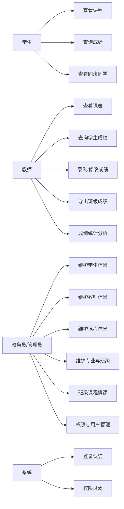
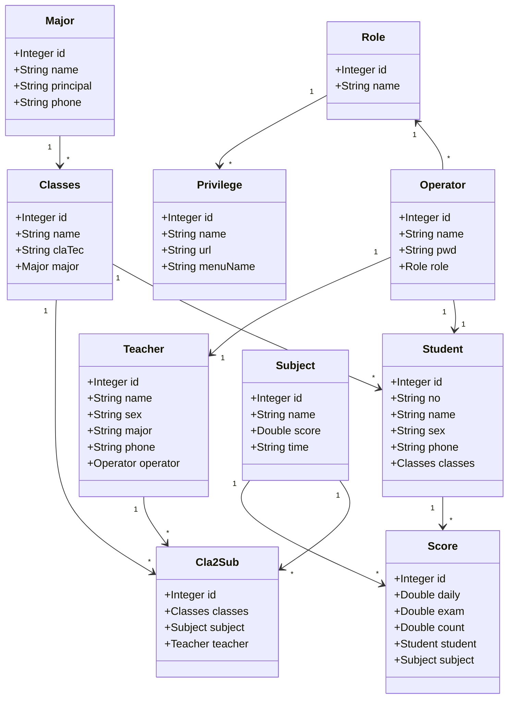
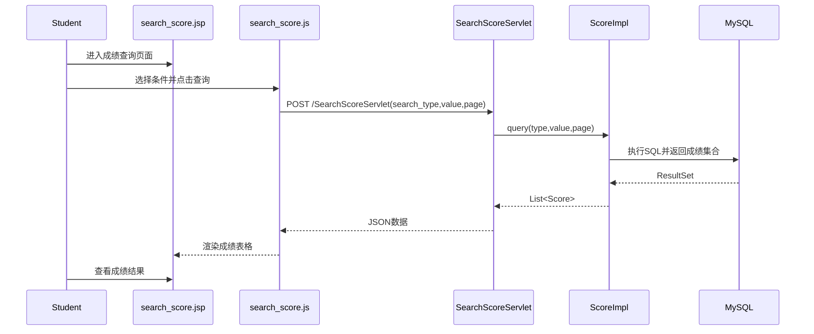
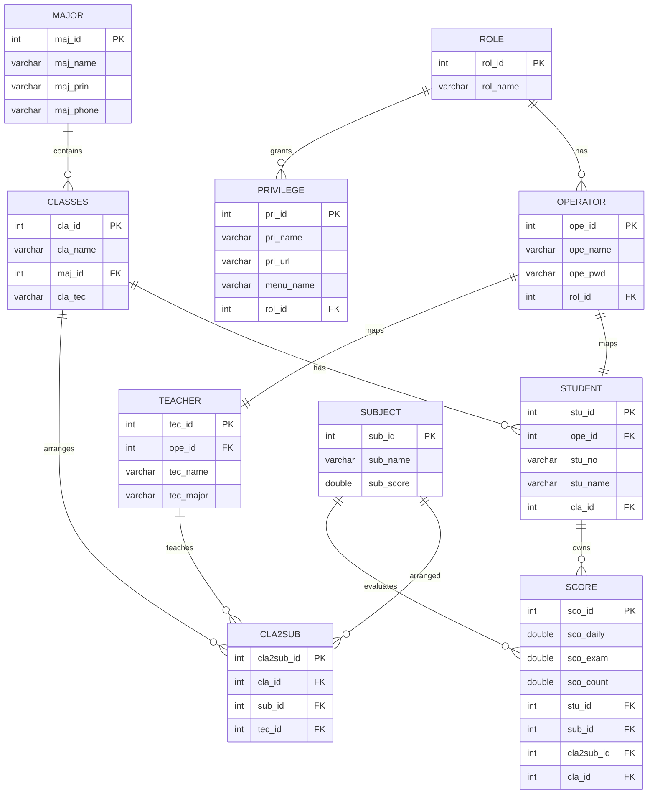
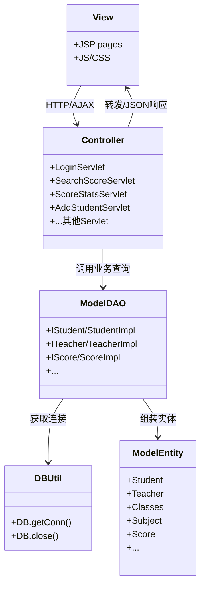

# 实验七建模图与任务对照

## 一、任务2：高校教学管理软件用例图（20分）
图名：UTMS-UseCase

## 二、任务3：面向对象分析类图（20分）
图名：UTMS-OOA-Class

## 三、任务4：学生查询课程和成绩顺序图（20分）
图名：UTMS-StudentScore-Sequence

## 四、任务5：数据库ER图（20分）
图名：UTMS-ER

## 五、任务6：结合MVC的软件类图与代码结构说明（40+5+5分）
图名：UTMS-MVC-Class

### 任务6-2：任务3与任务6类图关系总结（5分）
1. 任务3偏业务领域对象抽象（实体关系与业务属性）。
2. 任务6偏实现架构分层（View-Controller-Model-DB）。
3. 两者关系：任务3给出“是什么”，任务6给出“怎么实现”。

### 任务6-3：DAO包（题目中“fda包”按代码结构理解为dao层）用途分析（5分）
1. IStudent、ITeacher、IScore 等接口定义数据访问契约。
2. impl 包中的 StudentImpl、TeacherImpl、ScoreImpl 是接口实现。
3. 控制器 Servlet 通过 impl 访问数据库，避免页面直接操作 SQL。
4. dao/impl 分离便于后续替换数据源或重构业务逻辑。

## 六、任务7：新增功能说明（30+2分）
新增功能：教师/管理员成绩统计分析

已实现内容：
1. 后端接口：/Student/ScoreStatsServlet
2. 前端页面：pages/score_stats.jsp
3. 脚本样式：js/score_stats.js + css/score_stats.css
4. 页面入口：search_score.jsp 新增“成绩统计分析”链接（教师/管理员可见）
5. 统计指标：平均分、及格人数、不及格人数、及格率、分段分布图、分科目统计表

## 七、任务8：WBS
见根目录 [WBS.md](WBS.md)

## 八、任务完成性检查表
- [x] 任务1：部署与三类用户登录操作（代码和步骤文档已覆盖，截图需运行环境手动截取）
- [x] 任务2：用例图（本文件）
- [x] 任务3：面向对象分析类图（本文件）
- [x] 任务4：顺序图（本文件）
- [x] 任务5：ER图（本文件）
- [x] 任务6：MVC类图 + 图关系总结 + dao用途分析（本文件）
- [x] 任务7：新增可运行功能 + GitHub源码提交
- [x] 任务8：WBS（含计划/实际耗时）
